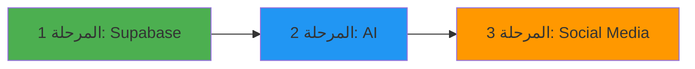

# 🚀 خطة تنفيذ مشروع AI Content Scheduler - 3 مراحل

## 📊 نظرة عامة

### الوضع الحالي ✅
- نظام المصادقة (Authentication) مكتمل ويعمل
- قاعدة البيانات Supabase مربوطة
- جدول `users` موجود
- البنية الأساسية للمشروع جاهزة (Next.js 16 + TypeScript)

### النهج الجديد
بدلاً من خطة معقدة على مدى أسبوعين، سنتبع نهج **مراحل متسلسلة** يركز على:
- **الربط (Integration)** - ربط كل نظام بشكل صحيح
- **إدارة الحالة (State Management)** - إدارة البيانات بشكل فعال

---

## 🎯 المراحل الثلاث



---

# 1️⃣ المرحلة الأولى: الاتصال مع Supabase

## 🎯 الهدف
إعداد قاعدة بيانات كاملة مع واجهات برمجية وإدارة حالة محترفة

## 📋 المهام الرئيسية

### أ) إعداد قاعدة البيانات

#### 1. إنشاء الجداول المتبقية
```sql
-- migrations/001_social_accounts.sql
CREATE TABLE social_accounts (
  id UUID PRIMARY KEY DEFAULT uuid_generate_v4(),
  user_id UUID REFERENCES users(id) ON DELETE CASCADE,
  platform VARCHAR(50) NOT NULL, -- 'twitter', 'facebook', 'linkedin'
  access_token TEXT,
  access_secret TEXT,
  refresh_token TEXT,
  token_expires_at TIMESTAMP,
  platform_user_id VARCHAR(255),
  platform_username VARCHAR(255),
  platform_name VARCHAR(255),
  platform_avatar TEXT,
  is_active BOOLEAN DEFAULT true,
  created_at TIMESTAMP DEFAULT NOW(),
  updated_at TIMESTAMP DEFAULT NOW()
);

CREATE INDEX idx_social_accounts_user_id ON social_accounts(user_id);
CREATE INDEX idx_social_accounts_platform ON social_accounts(platform);

-- migrations/002_posts.sql
CREATE TABLE posts (
  id UUID PRIMARY KEY DEFAULT uuid_generate_v4(),
  user_id UUID REFERENCES users(id) ON DELETE CASCADE,
  content TEXT NOT NULL,
  ai_prompt TEXT,
  platform VARCHAR(50) NOT NULL,
  status VARCHAR(20) DEFAULT 'draft', -- 'draft', 'scheduled', 'published', 'failed'
  scheduled_at TIMESTAMP,
  published_at TIMESTAMP,
  media_urls TEXT[],
  hashtags TEXT[],
  platform_post_id VARCHAR(255),
  platform_post_url TEXT,
  created_at TIMESTAMP DEFAULT NOW(),
  updated_at TIMESTAMP DEFAULT NOW()
);

CREATE INDEX idx_posts_user_id ON posts(user_id);
CREATE INDEX idx_posts_status ON posts(status);
CREATE INDEX idx_posts_scheduled_at ON posts(scheduled_at);

-- migrations/003_chat_messages.sql
CREATE TABLE chat_messages (
  id UUID PRIMARY KEY DEFAULT uuid_generate_v4(),
  user_id UUID REFERENCES users(id) ON DELETE CASCADE,
  role VARCHAR(20) NOT NULL, -- 'user', 'assistant'
  content TEXT NOT NULL,
  created_at TIMESTAMP DEFAULT NOW()
);

CREATE INDEX idx_chat_messages_user_id ON chat_messages(user_id);
CREATE INDEX idx_chat_messages_created_at ON chat_messages(created_at);
```

#### 2. إنشاء TypeScript Types
```typescript
// src/entities/social-account/types.ts
export type Platform = 'twitter' | 'facebook' | 'linkedin';

export interface SocialAccount {
  id: string;
  user_id: string;
  platform: Platform;
  access_token?: string;
  access_secret?: string;
  refresh_token?: string;
  token_expires_at?: string;
  platform_user_id?: string;
  platform_username?: string;
  platform_name?: string;
  platform_avatar?: string;
  is_active: boolean;
  created_at: string;
  updated_at: string;
}

// src/entities/post/types.ts
export type PostStatus = 'draft' | 'scheduled' | 'published' | 'failed';

export interface Post {
  id: string;
  user_id: string;
  content: string;
  ai_prompt?: string;
  platform: Platform;
  status: PostStatus;
  scheduled_at?: string;
  published_at?: string;
  media_urls?: string[];
  hashtags?: string[];
  platform_post_id?: string;
  platform_post_url?: string;
  created_at: string;
  updated_at: string;
}

// src/entities/chat/types.ts
export type MessageRole = 'user' | 'assistant';

export interface ChatMessage {
  id: string;
  user_id: string;
  role: MessageRole;
  content: string;
  created_at: string;
}
```

### ب) إنشاء API Routes

#### 1. Social Accounts APIs
```typescript
// src/app/api/social-accounts/route.ts
// GET - جلب جميع الحسابات للمستخدم الحالي
// POST - إضافة حساب جديد

// src/app/api/social-accounts/[id]/route.ts
// GET - جلب حساب محدد
// PUT - تحديث حساب
// DELETE - حذف حساب
```

#### 2. Posts APIs
```typescript
// src/app/api/posts/route.ts
// GET - جلب جميع المنشورات (مع فلترة)
// POST - إنشاء منشور جديد

// src/app/api/posts/[id]/route.ts
// GET - جلب منشور محدد
// PUT - تحديث منشور
// DELETE - حذف منشور
```

#### 3. Chat Messages APIs
```typescript
// src/app/api/chat/messages/route.ts
// GET - جلب تاريخ المحادثات
// POST - إضافة رسالة جديدة
```

### ج) إعداد State Management

#### استخدام TanStack Query + Zustand

**1. React Query Hooks للبيانات من الخادم**
```typescript
// src/entities/social-account/api/hooks.ts
export function useSocialAccounts() {
  return useQuery({
    queryKey: ['social-accounts'],
    queryFn: async () => {
      const res = await fetch('/api/social-accounts', {
        credentials: 'include'
      });
      if (!res.ok) throw new Error('Failed to fetch accounts');
      return res.json();
    }
  });
}

export function useCreateSocialAccount() {
  const queryClient = useQueryClient();
  return useMutation({
    mutationFn: async (data: Partial<SocialAccount>) => {
      const res = await fetch('/api/social-accounts', {
        method: 'POST',
        headers: { 'Content-Type': 'application/json' },
        credentials: 'include',
        body: JSON.stringify(data)
      });
      if (!res.ok) throw new Error('Failed to create account');
      return res.json();
    },
    onSuccess: () => {
      queryClient.invalidateQueries({ queryKey: ['social-accounts'] });
    }
  });
}

// src/entities/post/api/hooks.ts
export function usePosts(filters?: { status?: PostStatus; platform?: Platform }) {
  return useQuery({
    queryKey: ['posts', filters],
    queryFn: async () => {
      const params = new URLSearchParams(filters as any);
      const res = await fetch(`/api/posts?${params}`, {
        credentials: 'include'
      });
      if (!res.ok) throw new Error('Failed to fetch posts');
      return res.json();
    }
  });
}

export function useCreatePost() {
  const queryClient = useQueryClient();
  return useMutation({
    mutationFn: async (data: Partial<Post>) => {
      const res = await fetch('/api/posts', {
        method: 'POST',
        headers: { 'Content-Type': 'application/json' },
        credentials: 'include',
        body: JSON.stringify(data)
      });
      if (!res.ok) throw new Error('Failed to create post');
      return res.json();
    },
    onSuccess: () => {
      queryClient.invalidateQueries({ queryKey: ['posts'] });
    }
  });
}
```

**2. Zustand Store للحالة المحلية**
```typescript
// src/shared/store/ui-store.ts
import { create } from 'zustand';

interface UIState {
  isCreatePostModalOpen: boolean;
  selectedPost: Post | null;
  openCreatePostModal: () => void;
  closeCreatePostModal: () => void;
  setSelectedPost: (post: Post | null) => void;
}

export const useUIStore = create<UIState>((set) => ({
  isCreatePostModalOpen: false,
  selectedPost: null,
  openCreatePostModal: () => set({ isCreatePostModalOpen: true }),
  closeCreatePostModal: () => set({ isCreatePostModalOpen: false, selectedPost: null }),
  setSelectedPost: (post) => set({ selectedPost: post })
}));
```

## ✅ معايير إنجاز المرحلة الأولى

- ✅ جميع الجداول منشأة في Supabase وتعمل
- ✅ جميع API Routes موجودة وتستجيب بشكل صحيح
- ✅ TypeScript types كاملة ومستخدمة في جميع الملفات
- ✅ React Query hooks تعمل وتجلب البيانات
- ✅ Zustand stores معدة للحالة المحلية
- ✅ اختبار ناجح لجميع عمليات CRUD

---

# 2️⃣ المرحلة الثانية: ربط الذكاء الاصطناعي

## 🎯 الهدف
ربط نموذج AI مجاني (Google Gemini) مع نظام المحادثة وإدارة حالة المحادثات

## 📋 المهام الرئيسية

### أ) ربط Google Gemini API

#### 1. إعداد Gemini Client
```typescript
// src/shared/libs/ai/gemini-client.ts
import { GoogleGenerativeAI } from '@google/generative-ai';

const genAI = new GoogleGenerativeAI(process.env.GOOGLE_GEMINI_API_KEY!);

export async function generateContent(prompt: string): Promise<string> {
  try {
    const model = genAI.getGenerativeModel({ model: 'gemini-pro' });
    const result = await model.generateContent(prompt);
    const response = await result.response;
    return response.text();
  } catch (error) {
    console.error('Gemini API Error:', error);
    throw new Error('فشل في الاتصال بالذكاء الاصطناعي');
  }
}

export async function generateStreamContent(prompt: string) {
  const model = genAI.getGenerativeModel({ model: 'gemini-pro' });
  const result = await model.generateContentStream(prompt);
  return result.stream;
}
```

#### 2. تثبيت المكتبات المطلوبة
```bash
npm install @google/generative-ai
```

#### 3. إضافة Environment Variables
```bash
# .env.local
GOOGLE_GEMINI_API_KEY=your-gemini-api-key-here
```

### ب) إنشاء Chat API

```typescript
// src/app/api/chat/send/route.ts
import { NextRequest, NextResponse } from 'next/server';
import { withAuth } from '@/shared/libs/auth-middleware';
import { generateContent } from '@/shared/libs/ai/gemini-client';
import { supabaseServer } from '@/shared/libs/supabaseServer';

export async function POST(req: NextRequest) {
  return withAuth(req, async (req, user) => {
    try {
      const { message } = await req.json();

      // 1. حفظ رسالة المستخدم
      const { error: userMsgError } = await supabaseServer
        .from('chat_messages')
        .insert({
          user_id: user.userId,
          role: 'user',
          content: message
        });

      if (userMsgError) throw userMsgError;

      // 2. إرسال للـ AI
      const aiResponse = await generateContent(message);

      // 3. حفظ رد AI
      const { error: aiMsgError } = await supabaseServer
        .from('chat_messages')
        .insert({
          user_id: user.userId,
          role: 'assistant',
          content: aiResponse
        });

      if (aiMsgError) throw aiMsgError;

      return NextResponse.json({
        success: true,
        response: aiResponse
      });

    } catch (error: any) {
      return NextResponse.json(
        { error: error.message },
        { status: 500 }
      );
    }
  });
}
```

### ج) إنشاء Chat Interface

```typescript
// src/features/chat/ChatInterface.tsx
'use client';

import { useState } from 'react';
import { useMutation, useQueryClient } from '@tanstack/react-query';
import { useChatMessages } from '@/entities/chat/api/hooks';

export function ChatInterface() {
  const [input, setInput] = useState('');
  const { data: messages } = useChatMessages();
  const queryClient = useQueryClient();

  const sendMessage = useMutation({
    mutationFn: async (message: string) => {
      const res = await fetch('/api/chat/send', {
        method: 'POST',
        headers: { 'Content-Type': 'application/json' },
        credentials: 'include',
        body: JSON.stringify({ message })
      });
      if (!res.ok) throw new Error('فشل في إرسال الرسالة');
      return res.json();
    },
    onSuccess: () => {
      queryClient.invalidateQueries({ queryKey: ['chat-messages'] });
      setInput('');
    }
  });

  const handleSubmit = (e: React.FormEvent) => {
    e.preventDefault();
    if (input.trim()) {
      sendMessage.mutate(input);
    }
  };

  return (
    <div className="flex flex-col h-full">
      {/* Messages List */}
      <div className="flex-1 overflow-y-auto p-4 space-y-4">
        {messages?.map((msg) => (
          <div
            key={msg.id}
            className={`flex ${msg.role === 'user' ? 'justify-end' : 'justify-start'}`}
          >
            <div
              className={`max-w-[70%] rounded-lg p-3 ${
                msg.role === 'user'
                  ? 'bg-blue-500 text-white'
                  : 'bg-gray-200 text-gray-900'
              }`}
            >
              {msg.content}
            </div>
          </div>
        ))}
        {sendMessage.isPending && (
          <div className="flex justify-start">
            <div className="bg-gray-200 rounded-lg p-3">
              <div className="flex space-x-2">
                <div className="w-2 h-2 bg-gray-400 rounded-full animate-bounce" />
                <div className="w-2 h-2 bg-gray-400 rounded-full animate-bounce delay-100" />
                <div className="w-2 h-2 bg-gray-400 rounded-full animate-bounce delay-200" />
              </div>
            </div>
          </div>
        )}
      </div>

      {/* Input Form */}
      <form onSubmit={handleSubmit} className="p-4 border-t">
        <div className="flex gap-2">
          <input
            type="text"
            value={input}
            onChange={(e) => setInput(e.target.value)}
            placeholder="اكتب رسالتك..."
            className="flex-1 px-4 py-2 border rounded-lg focus:outline-none focus:ring-2 focus:ring-blue-500"
            disabled={sendMessage.isPending}
          />
          <button
            type="submit"
            disabled={sendMessage.isPending || !input.trim()}
            className="px-6 py-2 bg-blue-500 text-white rounded-lg hover:bg-blue-600 disabled:opacity-50"
          >
            إرسال
          </button>
        </div>
      </form>
    </div>
  );
}
```

### د) إعداد State Management للمحادثات

```typescript
// src/entities/chat/api/hooks.ts
export function useChatMessages() {
  return useQuery({
    queryKey: ['chat-messages'],
    queryFn: async () => {
      const res = await fetch('/api/chat/messages', {
        credentials: 'include'
      });
      if (!res.ok) throw new Error('Failed to fetch messages');
      const data = await res.json();
      return data.messages as ChatMessage[];
    }
  });
}

// src/shared/store/chat-store.ts
import { create } from 'zustand';

interface ChatState {
  isChatOpen: boolean;
  currentPrompt: string;
  openChat: () => void;
  closeChat: () => void;
  setCurrentPrompt: (prompt: string) => void;
}

export const useChatStore = create<ChatState>((set) => ({
  isChatOpen: false,
  currentPrompt: '',
  openChat: () => set({ isChatOpen: true }),
  closeChat: () => set({ isChatOpen: false }),
  setCurrentPrompt: (prompt) => set({ currentPrompt: prompt })
}));
```

### هـ) دمج AI مع نظام المنشورات

```typescript
// src/features/posts/PostEditorWithAI.tsx
export function PostEditorWithAI() {
  const [content, setContent] = useState('');
  const { openChat } = useChatStore();
  const createPost = useCreatePost();

  const handleAIAssist = () => {
    openChat(); // فتح نافذة المحادثة
  };

  return (
    <div className="space-y-4">
      <div className="flex justify-between items-center">
        <h2>إنشاء منشور جديد</h2>
        <button
          onClick={handleAIAssist}
          className="flex items-center gap-2 px-4 py-2 bg-purple-500 text-white rounded-lg"
        >
          ✨ اطلب من AI
        </button>
      </div>
      
      <textarea
        value={content}
        onChange={(e) => setContent(e.target.value)}
        className="w-full h-32 p-3 border rounded-lg"
        placeholder="ماذا تريد أن تنشر؟"
      />
      
      <button
        onClick={() => createPost.mutate({ content, status: 'draft' })}
        className="px-6 py-2 bg-blue-500 text-white rounded-lg"
      >
        حفظ كمسودة
      </button>
    </div>
  );
}
```

## ✅ معايير إنجاز المرحلة الثانية

- ✅ Google Gemini API مربوط ويعمل
- ✅ واجهة المحادثة تعمل بشكل سلس
- ✅ الرسائل تُحفظ في قاعدة البيانات
- ✅ State management للمحادثات يعمل
- ✅ AI مدمج مع نظام المنشورات
- ✅ اختبار ناجح لجميع ميزات AI

---

# 3️⃣ المرحلة الثالثة: ربط مواقع التواصل الاجتماعي

## 🎯 الهدف
ربط Twitter و Facebook وإنشاء نظام النشر التلقائي

## 📋 المهام الرئيسية

### أ) ربط Twitter

#### 1. إعداد Twitter OAuth
```typescript
// src/app/api/oauth/twitter/route.ts
import { NextRequest, NextResponse } from 'next/server';

export async function GET(req: NextRequest) {
  const authUrl = `https://twitter.com/i/oauth2/authorize?` +
    `response_type=code` +
    `&client_id=${process.env.TWITTER_CLIENT_ID}` +
    `&redirect_uri=${process.env.TWITTER_CALLBACK_URL}` +
    `&scope=tweet.read tweet.write users.read offline.access` +
    `&state=random_state` +
    `&code_challenge=challenge` +
    `&code_challenge_method=plain`;

  return NextResponse.redirect(authUrl);
}

// src/app/api/oauth/twitter/callback/route.ts
export async function GET(req: NextRequest) {
  const code = req.nextUrl.searchParams.get('code');
  
  // تبادل code بـ access_token
  const tokenResponse = await fetch('https://api.twitter.com/2/oauth2/token', {
    method: 'POST',
    headers: { 'Content-Type': 'application/x-www-form-urlencoded' },
    body: new URLSearchParams({
      code: code!,
      grant_type: 'authorization_code',
      client_id: process.env.TWITTER_CLIENT_ID!,
      redirect_uri: process.env.TWITTER_CALLBACK_URL!,
      code_verifier: 'challenge'
    })
  });

  const tokens = await tokenResponse.json();

  // حفظ في database (مشفّر)
  // ...

  return NextResponse.redirect('/dashboard?connected=twitter');
}
```

#### 2. Twitter Publishing Client
```typescript
// src/shared/libs/twitter/client.ts
export async function publishTweet(accessToken: string, content: string) {
  const response = await fetch('https://api.twitter.com/2/tweets', {
    method: 'POST',
    headers: {
      'Authorization': `Bearer ${accessToken}`,
      'Content-Type': 'application/json'
    },
    body: JSON.stringify({ text: content })
  });

  if (!response.ok) {
    throw new Error('فشل في نشر التغريدة');
  }

  return response.json();
}
```

### ب) ربط Facebook

#### 1. إعداد Facebook OAuth
```typescript
// src/app/api/oauth/facebook/route.ts
export async function GET(req: NextRequest) {
  const authUrl = `https://www.facebook.com/v18.0/dialog/oauth?` +
    `client_id=${process.env.FACEBOOK_APP_ID}` +
    `&redirect_uri=${process.env.FACEBOOK_CALLBACK_URL}` +
    `&scope=pages_manage_posts,pages_read_engagement`;

  return NextResponse.redirect(authUrl);
}

// src/app/api/oauth/facebook/callback/route.ts
// مشابه لـ Twitter
```

#### 2. Facebook Publishing Client
```typescript
// src/shared/libs/facebook/client.ts
export async function publishToFacebookPage(
  pageAccessToken: string,
  pageId: string,
  message: string
) {
  const response = await fetch(
    `https://graph.facebook.com/v18.0/${pageId}/feed`,
    {
      method: 'POST',
      headers: { 'Content-Type': 'application/json' },
      body: JSON.stringify({
        message,
        access_token: pageAccessToken
      })
    }
  );

  if (!response.ok) {
    throw new Error('فشل في النشر على Facebook');
  }

  return response.json();
}
```

### ج) إعداد State Management للحسابات المربوطة

```typescript
// src/shared/store/accounts-store.ts
import { create } from 'zustand';
import { SocialAccount } from '@/entities/social-account/types';

interface AccountsState {
  connectedAccounts: SocialAccount[];
  selectedAccount: SocialAccount | null;
  setConnectedAccounts: (accounts: SocialAccount[]) => void;
  selectAccount: (account: SocialAccount | null) => void;
  removeAccount: (accountId: string) => void;
}

export const useAccountsStore = create<AccountsState>((set) => ({
  connectedAccounts: [],
  selectedAccount: null,
  setConnectedAccounts: (accounts) => set({ connectedAccounts: accounts }),
  selectAccount: (account) => set({ selectedAccount: account }),
  removeAccount: (accountId) => set((state) => ({
    connectedAccounts: state.connectedAccounts.filter(a => a.id !== accountId)
  }))
}));
```

### د) نظام الجدولة والنشر التلقائي

#### 1. Cron Job للنشر
```typescript
// src/app/api/cron/publish-scheduled/route.ts
import { NextResponse } from 'next/server';
import { supabaseServer } from '@/shared/libs/supabaseServer';
import { publishTweet } from '@/shared/libs/twitter/client';
import { publishToFacebookPage } from '@/shared/libs/facebook/client';

export async function GET() {
  try {
    // جلب المنشورات المجدولة التي حان وقتها
    const { data: posts, error } = await supabaseServer
      .from('posts')
      .select('*, social_accounts(*)')
      .eq('status', 'scheduled')
      .lte('scheduled_at', new Date().toISOString());

    if (error) throw error;

    for (const post of posts || []) {
      try {
        let publishedUrl = '';

        // النشر حسب المنصة
        if (post.platform === 'twitter') {
          const result = await publishTweet(
            post.social_accounts.access_token,
            post.content
          );
          publishedUrl = `https://twitter.com/i/web/status/${result.data.id}`;
        } else if (post.platform === 'facebook') {
          const result = await publishToFacebookPage(
            post.social_accounts.access_token,
            post.social_accounts.platform_user_id,
            post.content
          );
          publishedUrl = `https://facebook.com/${result.id}`;
        }

        // تحديث حالة المنشور
        await supabaseServer
          .from('posts')
          .update({
            status: 'published',
            published_at: new Date().toISOString(),
            platform_post_url: publishedUrl
          })
          .eq('id', post.id);

      } catch (error) {
        // تسجيل الفشل
        await supabaseServer
          .from('posts')
          .update({ status: 'failed' })
          .eq('id', post.id);
      }
    }

    return NextResponse.json({ success: true, published: posts?.length || 0 });

  } catch (error: any) {
    return NextResponse.json({ error: error.message }, { status: 500 });
  }
}
```

#### 2. تفعيل Cron على Vercel
```json
// vercel.json
{
  "crons": [
    {
      "path": "/api/cron/publish-scheduled",
      "schedule": "* * * * *"
    }
  ]
}
```

### هـ) واجهة إدارة الحسابات والنشر

```typescript
// src/features/social-accounts/ConnectedAccounts.tsx
export function ConnectedAccounts() {
  const { data: accounts } = useSocialAccounts();

  return (
    <div className="space-y-4">
      <h2 className="text-xl font-bold">الحسابات المربوطة</h2>
      
      <div className="grid grid-cols-1 md:grid-cols-2 gap-4">
        {accounts?.map((account) => (
          <div key={account.id} className="border rounded-lg p-4">
            <div className="flex items-center gap-3">
              
              <div>
                <div className="font-semibold">{account.platform_name}</div>
                <div className="text-sm text-gray-500">@{account.platform_username}</div>
              </div>
            </div>
          </div>
        ))}
      </div>

      <div className="flex gap-2">
        <button
          onClick={() => window.location.href = '/api/oauth/twitter'}
          className="px-4 py-2 bg-blue-400 text-white rounded-lg"
        >
          + ربط Twitter
        </button>
        <button
          onClick={() => window.location.href = '/api/oauth/facebook'}
          className="px-4 py-2 bg-blue-600 text-white rounded-lg"
        >
          + ربط Facebook
        </button>
      </div>
    </div>
  );
}
```

## ✅ معايير إنجاز المرحلة الثالثة

- ✅ يمكن ربط حسابات Twitter و Facebook
- ✅ يمكن النشر على كلا المنصتين بنجاح
- ✅ نظام الجدولة يعمل تلقائياً
- ✅ State management للحسابات يعمل
- ✅ Cron jobs تعمل على Vercel
- ✅ اختبار شامل end-to-end للنظام بالكامل

---

## 📦 الملخص النهائي

بعد إتمام المراحل الثلاث، سيكون لديك:

### ✅ المرحلة 1 - Supabase
- قاعدة بيانات كاملة (4 جداول)
- API Routes شاملة
- State management بـ React Query + Zustand

### ✅ المرحلة 2 - AI
- Google Gemini مربوط
- واجهة محادثة تفاعلية
- AI مدمج مع المنشورات

### ✅ المرحلة 3 - Social Media
- ربط Twitter و Facebook
- نظام نشر تلقائي
- إدارة الحسابات والمنشورات

---

## 🎯 الخطوات التالية

بعد موافقتك على هذه الخطة، يمكننا البدء مباشرة بـ**المرحلة الأولى** وإنشاء:
1. SQL scripts للجداول
2. TypeScript types
3. API routes
4. React Query hooks
5. Zustand stores

**جاهز للبدء؟** 🚀
